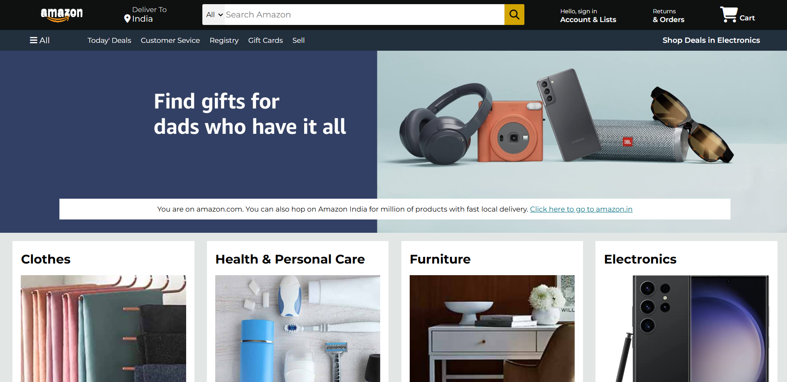
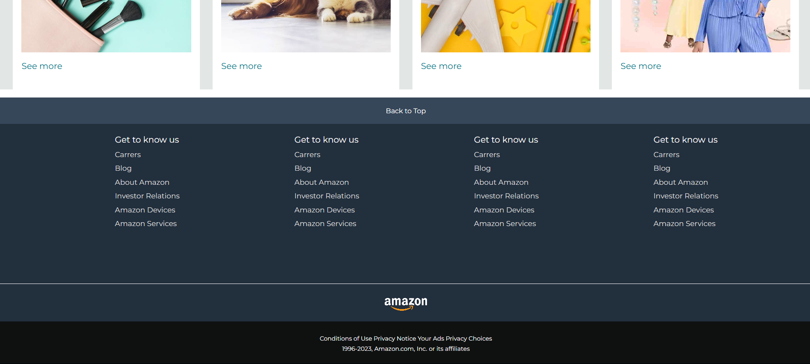

<h1 align="center">🛒 Amazon Clone</h1>

<p align="center">
  
  
  
</p>

---

## 🧾 Project Overview

This is a **static clone** of the Amazon homepage built with **HTML** and **CSS**. It mimics the layout and core visual structure of the Amazon.com landing page, including:

- Navigation bar with logo, search bar, sign-in, cart
- Hero section with promotional banner
- Product category cards (clothes, electronics, beauty, etc.)
- Footer with multiple panels and links

---

## 🧰 Technologies Used

<p align="center">
  
  
  
  
</p>

---

## ✨ Features

- 🛍️ Amazon-style header with logo, search bar, and cart
- 🧭 Navigation panel with categories like Deals, Registry, Gift Cards
- 🎯 Hero section with full-width background and promo message
- 📦 Product grid with images, titles, and hover effects
- 🦶 Clean, responsive footer with multiple link panels
- 🎨 Styled using custom CSS, Font Awesome, and Google Fonts

---

## 📸 Screenshots

<div align="center">
  
  
</div>

---

## 🛠️ Getting Started

Follow these steps to view it locally:

### Clone the Repository
```bash
git clone https://github.com/your-username/amazon-clone.git
cd amazon-clone
Just open the index.html file directly in your preferred browser.
```
---

## 🙋‍♂️ Connect with Me
<p align="center"> <a href="https://www.linkedin.com/in/samarth-jaiswal-72b67b313/" target="_blank">  </a> <a href="mailto:samjaiswal51@gmail.com">  </a> </p>

---

## ⚠️ Disclaimer
This is a frontend-only project for educational purposes and is not affiliated with Amazon.

---

#### 💬 Feel free to star ⭐ the repo, fork 🍴 it, or open issues 🛠️ for suggestions!
